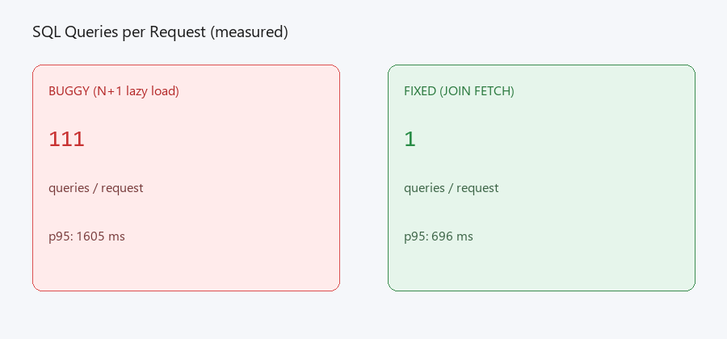

# 111 SQL Queries Per Request to 1: Spring Boot Performance Case Study

Slow APIs often look fine in a single curl, then collapse under real traffic because Hibernate is firing hidden SELECTs on every row. This repo reproduces that failure class, fixes it with JOIN FETCH, and proves the improvement with measured before/after numbers on the same hardware.

At Careem I shipped the same class of fix on a production ORM path: p99 dropped from ~8s to under 1s, and SQL round trips fell from 1,286 to 2 batch calls. This case study isolates the pattern so you can reproduce and verify it locally.

---

## Results at a glance

Load test: k6 `shared-iterations`, 100 VUs, 100,000 HTTP requests per endpoint, `http://localhost:8080`. Seed: 10 users x 10 orders x 10 items = 100 orders, 1,000 line items. Measured Jun 16, 2026 (re-run via `scripts/run-benchmark.ps1`).

| Mode | SQL queries / request | Total requests | k6 p95 (ms) | k6 avg (ms) | Throughput (req/s) | Error rate |
|------|----------------------|----------------|-------------|-------------|-------------------|------------|
| **Before** (`/api/orders/buggy`) | 111 | 100,000 | **1,605** | 868 | 115.2 | 0% |
| **After** (`/api/orders/fixed`) | 1 | 100,000 | **760** | 505 | 197.8 | 0% |
| **Improvement** | 111x fewer queries | same load profile | **2.1x faster p95** | 1.7x faster avg | 1.7x more throughput | 0% both runs |

Query counts come from a Hibernate `StatementInspector` wired in `JpaConfig` (response header `X-Query-Count` and `/api/orders/stats/*`).



---

## The problem

`GET /api/orders` loads 100 orders with 10 line items each. The buggy path uses `FetchType.LAZY` on `Order.items` and `Order.user`, then maps every order in a loop. Hibernate issues one SELECT for orders, then one SELECT per order for items, plus user lookups (**111 SQL statements** on seeded data).

### Buggy code

Repository uses plain `findAll()` with no fetch plan:

```java
List<Order> orders = orderRepository.findAll();
return orders.stream().map(this::mapOrderWithLazyLoads).toList();
```

Service intentionally touches lazy associations per order:

```java
private OrderSummaryDto mapOrderWithLazyLoads(Order order) {
    String customerName = order.getUser().getName();      // N user SELECTs (L1-cached per user)
    List<OrderItemDto> items = order.getItems().stream()  // N item SELECTs
        .map(...)
        .toList();
    return toSummary(order, customerName, items);
}
```

**Endpoint:** `GET /api/orders/buggy`  
**Measured:** `X-Query-Count: 111` for 100 orders (see `/api/orders/stats/buggy`)

### Fix

`JOIN FETCH` on the hot read path loads orders, users, and items in a single round trip:

```java
@Query("""
        SELECT DISTINCT o FROM Order o
        JOIN FETCH o.user u
        JOIN FETCH o.items i
        ORDER BY o.id, i.id
        """)
List<Order> findAllOrdersWithItemsAndUser();
```

#### Why JOIN FETCH (not @EntityGraph or batch size)

| Approach | Chosen? | Reason |
|----------|---------|--------|
| **JOIN FETCH** | Yes | One explicit query, easy to EXPLAIN, predictable for list endpoints |
| @EntityGraph | No | Same SQL, but less visible in code review; harder to show in audit |
| `default_batch_fetch_size` | No | Hides N+1 (drops to ~10 queries), masks the failure mode in review |
| DTO projection | Good at scale | Overkill here; JOIN FETCH is the minimal fix |

**Endpoint:** `GET /api/orders/fixed`  
**Measured:** `X-Query-Count: 1` for 100 orders

---

## Documentation

| Resource | Path |
|----------|------|
| EXPLAIN ANALYZE walkthrough | [docs/explain-analyze.md](docs/explain-analyze.md) |
| Sample audit report (filled) | [docs/audit-report-template.md](docs/audit-report-template.md) |
| Sample Phase 1 audit SOW | [docs/PHASE-1-AUDIT-SOW.md](docs/PHASE-1-AUDIT-SOW.md) |
| Performance investigation checklist | [docs/FIRST-2-HOURS-CHECKLIST.md](docs/FIRST-2-HOURS-CHECKLIST.md) |
| Benchmark images | [docs/images/](docs/images/) |
| k6 load script | [load/k6-load.js](load/k6-load.js) |

---

## Run it locally

### One command

```bash
cd spring-perf-rescue-lab
docker compose up --build
```

Wait for health, then:

```bash
curl http://localhost:8080/actuator/health
curl -s -D - http://localhost:8080/api/orders/buggy -o /dev/null | grep X-Query-Count
curl -s -D - http://localhost:8080/api/orders/fixed -o /dev/null | grep X-Query-Count
```

Connection pool is tuned for heavy load (`maximum-pool-size: 50`). Benchmark scripts run a short warmup before the 100k run.

### Load test (k6)

Default profile: 100 VUs, 100,000 shared iterations per endpoint.

```bash
k6 run -e BASE_URL=http://localhost:8080 -e ENDPOINT=/api/orders/buggy -e MODE=buggy load/k6-load.js
k6 run -e BASE_URL=http://localhost:8080 -e ENDPOINT=/api/orders/fixed -e MODE=fixed load/k6-load.js
```

Or run both with warmup:

```bash
pwsh scripts/run-benchmark.ps1
# bash scripts/run-benchmark.sh
```

Summaries are written to `load/results/buggy-summary.json` and `load/results/fixed-summary.json`.

### EXPLAIN ANALYZE

See [docs/explain-analyze.md](docs/explain-analyze.md) for SQL commands and sample output.

```bash
docker compose exec postgres psql -U perf -d perf_lab
```

---

## API endpoints

| Endpoint | Purpose |
|----------|---------|
| `GET /api/orders/buggy` | N+1 path, full JSON payload |
| `GET /api/orders/fixed` | JOIN FETCH path, full JSON payload |
| `GET /api/orders/stats/buggy` | Query count only (lightweight) |
| `GET /api/orders/stats/fixed` | Query count only (lightweight) |
| `GET /actuator/health` | Health check |

---

## Stack

- Java 17, Spring Boot 3.2, Spring Data JPA
- PostgreSQL 16
- Docker Compose (app + database)
- k6 for load testing
